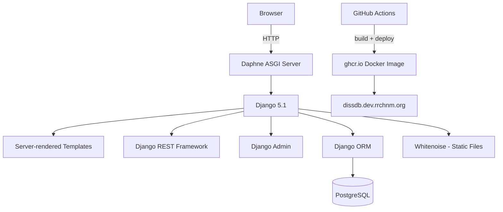

# AGENTS.md

> For feature specifications, business rules, and domain models, see [SPEC.md](./SPEC.md).

---

## Table of Contents

- [Project Overview](#project-overview)
- [Tech Stack](#tech-stack)
  - [Package Management](#package-management)
  - [Backend](#backend)
  - [Frontend](#frontend)
  - [Database](#database)
- [Project Initialization](#project-initialization)
- [Project Structure](#project-structure)
- [Architecture](#architecture)
  - [System Architecture Diagram](#system-architecture-diagram)
  - [REST API Design](#rest-api-design)
- [Authentication & Authorization](#authentication--authorization)
  - [User Auth](#user-auth)
  - [API Auth](#api-auth)
- [Development Workflow](#development-workflow)
  - [Version Control](#version-control)
  - [Database Migrations](#database-migrations)
  - [Debugging & Logging](#debugging--logging)
  - [Serving the Application](#serving-the-application)
  - [Testing Approach](#testing-approach)
- [Best Practices & Key Conventions](#best-practices--key-conventions)
- [Notes for AI Agents](#notes-for-ai-agents)

---

## Project Overview

History Dissertation Database is a Django web application developed by the Roy Rosenzweig Center for History and New Media (RRCHNM) at George Mason University. It tracks history dissertations and enables researchers to explore scholarly genealogies — the advisor/advisee chains that connect historians across institutions and generations.

**Core goals:**
- Aggregate dissertation data from the American Historical Association (AHA) and other sources
- Model the mentorship relationships between scholars via dissertation committee records
- Provide browsable, filterable public views and a REST API for the data
- Support data stewardship: provenance tracking, change history, and duplicate detection

**Target users:** Digital historians, academic researchers, and RRCHNM staff maintaining the data.

---

## Tech Stack

The application is a server-rendered Django app with Tailwind CSS for styling and a thin DRF-based REST API. There is no separate SPA frontend.

### Package Management

- **Python:** [Poetry](https://python-poetry.org/) (`pyproject.toml` / `poetry.lock`). Run all Python commands via `poetry run` or inside `poetry shell`.
- **Node.js:** npm with version pinned via [Volta](https://volta.sh/) (`node: 18.15.0`, `npm: 9.6.3` in `package.json`). Used only for compiling Tailwind CSS.
- **Makefile shortcuts:** `make preview`, `make mm`, `make migrate`, `make tailwind-build`, `make tailwind-start`.

### Backend

- **Runtime/Framework:** Python 3.12, Django 5.1
- **ASGI server:** Daphne (configured in `INSTALLED_APPS` and `ASGI_APPLICATION`)
- **Key libraries:**
  - `django-tailwind` — Tailwind CSS integration and build pipeline
  - `django-tables2` — sortable, paginated HTML tables
  - `django-filter` — URL-driven queryset filtering
  - `djangorestframework` — REST API for scholar data
  - `django-simple-history` — full audit trail on all models via `HistoricalRecords()`
  - `whitenoise` — static file serving in production
  - `django-environ` / `python-dotenv` — environment variable configuration
  - `psycopg2` — PostgreSQL adapter

### Frontend

Django server-rendered templates (`templates/`) with Tailwind CSS. No JavaScript framework. The scholarly genealogy tree visualization uses a plain JS library (`save-svg-as-png` for PNG export). Tailwind plugins in use: `@tailwindcss/typography`, `@tailwindcss/forms`, `@tailwindcss/aspect-ratio`.

### Database

- **Database:** PostgreSQL (required; SQLite is commented out in settings)
- **ORM:** Django ORM
- **Migrations:** Django's built-in migration framework (`dissdb/migrations/`)
- Connection configured via `.env`: `DB_HOST`, `DB_PORT`, `DB_NAME`, `DB_USER`, `DB_PASS`
- Optional S3-compatible object storage for media (disabled by default; toggle with `OBJ_STORAGE=true` in `.env`)

---

## Project Initialization

**Prerequisites:** Python 3.12+, PostgreSQL, Node.js 18 (via Volta or manually), Poetry.

```bash
# 1. Install Python dependencies
poetry install
poetry shell

# 2. Configure environment
cp .env .env.local   # .env already has sane local defaults; edit DB credentials

# 3. Install and configure pre-commit hooks
pre-commit install

# 4. Set up the database
createdb dissdb
python manage.py migrate
python manage.py loaddata db.json        # optional: load seed data

# 5. Build CSS
python manage.py tailwind install        # installs npm packages
python manage.py tailwind build

# 6. Run the dev server
make preview                             # http://127.0.0.1:8000

# 7. Create a superuser for admin access
python manage.py createsuperuser
```

**Docker alternative:**
```bash
docker-compose up --build
```

---

## Project Structure

```
diss-db/
├── config/                  # Django project: settings, root URLconf, ASGI/WSGI
├── dissdb/                  # Sole Django app — all models, views, admin, API, filters
│   ├── management/
│   │   └── commands/        # import_aha_data.py, find_duplicates.py
│   ├── migrations/          # Auto-generated Django migrations
│   ├── templatetags/        # Custom template tags
│   ├── admin.py             # Rich admin classes with SimpleHistoryAdmin
│   ├── filters.py           # django-filter FilterSet classes
│   ├── models.py            # All data models
│   ├── serializers.py       # DRF serializers
│   ├── tables.py            # django-tables2 Table classes
│   ├── urls.py              # App-level URL patterns
│   └── views.py             # Class-based and function-based views + API views
├── theme/                   # django-tailwind app (do not edit CSS here directly)
├── templates/
│   ├── base.html            # Site-wide base template
│   ├── index.html / about.html
│   └── dissertations/       # Per-view templates: dissertation_filter, scholar_detail, etc.
├── static/                  # Source static assets (served by Whitenoise in prod)
├── aha-data/                # Raw AHA CSV source files (not committed — gitignored)
├── fixtures/                # Django fixture files for seed data
├── Makefile                 # Common command shortcuts
├── pyproject.toml           # Poetry config and dev dependencies
└── docker-compose.yml       # Local Docker setup
```

---

## Architecture

### System Architecture Diagram



**Data model relationships:**
- `Scholar` is the central entity. Each `Dissertation` has one `author` (Scholar) and one `school` (School).
- `CommitteeMember` joins Scholar → Dissertation with a `role` of `chair` or `reader`. The **chair role encodes the advisor/advisee relationship** used for genealogy tree traversal.
- All models have a `source` FK to `Source` (provenance tracking) and `HistoricalRecords()` (full audit trail).
- `DuplicateCandidate` stores pairs of potentially duplicate Scholars awaiting manual review.

### REST API Design

Base path: no versioning prefix (current). Patterns:

| Endpoint | Method | Description |
|---|---|---|
| `/scholars/api/` | GET | Paginated list of scholars (`aha_scholar_id`, `name_full`) |
| `/scholars/api/<id>/` | GET | Single scholar detail |
| `/api/get_viz_data/<pk>` | GET | Shallow genealogy tree data for a scholar |
| `/api/get_viz_data_complex/<pk>` | GET | Full ancestor-to-descendant genealogy tree |

Viz endpoints return JSON arrays of slash-delimited path strings (e.g. `"Advisor/Scholar/Advisee"`), consumed by the client-side tree visualization.

---

## Authentication & Authorization

### User Auth

Standard Django session-based authentication. Admin access at `/admin/` requires a superuser account created with `python manage.py createsuperuser`. The public-facing views (`/dissertations/`, `/scholar/<pk>`, etc.) require no authentication.

### API Auth

The REST API endpoints are currently open (no authentication required). DRF is configured with default settings; no token or OAuth mechanism is in place. The `ScholarSerializer` exposes only `aha_scholar_id` and `name_full`.

---

## Development Workflow

### Version Control

- **Branching:** Feature branches merged to `main` via PRs. The `preview` branch deploys to the dev environment at `dissdb.dev.rrchnm.org`.
- **CI/CD:** GitHub Actions (`.github/workflows/cicd.yml`) builds and publishes a Docker image to `ghcr.io` on push to `main` or `preview`, then deploys via a shared RRCHNM workflow.
- **Commit style:** Conventional Commits where possible (`feat:`, `fix:`, `build:`, `docs:`).

### Database Migrations

```bash
make mm        # python manage.py makemigrations
make migrate   # python manage.py migrate
```

Always commit migration files alongside the model changes that generated them. Do not squash migrations without team discussion — historical data imports rely on stable migration state.

### Debugging & Logging

`django-debug-toolbar` is always enabled in development (hardcoded `DEBUG = True` in `config/settings.py`). It appears on all HTML pages at the side panel. Standard Django logging to console.

### Serving the Application

**Development:**
```bash
make preview          # runs on http://127.0.0.1:8000
make tailwind-start   # run in a separate terminal for CSS hot-reload
```

**Production:** Docker image built by GitHub Actions and deployed to `dissdb.dev.rrchnm.org`. Static files served by Whitenoise middleware; no separate CDN currently configured.

### Testing Approach

- **Framework:** pytest via `pytest-django`
- **Run all tests:** `pytest`
- **Run a single test:** `pytest dissdb/tests.py::TestClassName::test_method_name`
- Test files live in `dissdb/tests.py`. The test suite is currently sparse; new features should include pytest tests covering model logic and views.

---

## Best Practices & Key Conventions

**Code style:**
- Formatter and linter: **Ruff** (replaces Black + Flake8). Run via `ruff format .` and `ruff check .`.
- Import sorting: **isort** with `--profile black`.
- HTML templates: **djhtml** for indentation.
- All enforced via pre-commit hooks; run `pre-commit run --all-files` before opening a PR.

**Model conventions:**
- Every model must have a `source = models.ForeignKey(Source, ...)` field for data provenance.
- Every model must include `history = HistoricalRecords()` for audit trail.
- AHA-sourced fields (`aha_scholar_id`, `aha_name`, `aha_dissertation_id`, etc.) are stored as `editable=False` read-only fields — they record what the AHA provided and should not be modified manually.

**Naming:**
- Python: snake_case for variables/functions, PascalCase for classes.
- Model fields: snake_case. Name fields follow the pattern `name_first`, `name_middle`, `name_last`, `name_suffix` — do not collapse into a single `name` field.
- URL names: kebab-case (e.g., `scholar-detail`, `diss-detail`).

**Data integrity:**
- Use `on_delete=models.PROTECT` for FK relationships to scholar and dissertation records to prevent accidental cascading deletes.
- `DissertationLink.url` is `unique_together` with `dissertation` to prevent duplicate links.

---

## Notes for AI Agents

**Preferred patterns:**
- Use `django-tables2` (`SingleTableMixin`, `FilterView`) for any new list views, following the pattern in `FilteredDissertationListView`.
- Use `SimpleHistoryAdmin` as the base for all new `ModelAdmin` classes.
- Use `generics.ListAPIView` / `APIView` from DRF for new API endpoints.
- The `Source` FK defaults to `default=1` (the AHA source record) — preserve this pattern on new models.

**Known technical debt:**
- `config/settings.py` has `DEBUG = True` hardcoded. The env-var-based `DEBUG` line is commented out. Do not remove the commented line; it marks an intentional TODO for production hardening.
- Several commented-out code blocks remain in `views.py` and `urls.py` from earlier `aha_scholar_id`-based queries, replaced by `id`-based queries. These can be removed.
- `dissdb/serializers.py` only exposes `aha_scholar_id` and `name_full` — the API is intentionally minimal.
- `DissDetailView` is commented out in `views.py`; the `/dissertations/<pk>` URL route is also commented out. Dissertation detail pages are not yet implemented.

**When making changes:**
- Run `pre-commit run --all-files` before committing — the CI will fail otherwise.
- After any model change, create a migration with `make mm` and commit it with the change.
- The genealogy tree traversal logic (`traverse()` and `get_viz_data_complex()`) is recursive and can be slow for deeply nested advisor chains. Avoid adding ORM calls inside the traversal loop.

**What to avoid:**
- Do not use `aha_scholar_id` as a lookup key in new code — use the `id` primary key. The AHA ID fields exist for data tracing only.
- Do not add `CASCADE` deletes on Scholar or Dissertation foreign keys — data preservation is a priority.
- Do not remove the `HistoricalRecords()` or `Source` FK from any model.

---

*Last Updated: 2026-03-03*
*This document is maintained for AI agent context and onboarding.*
